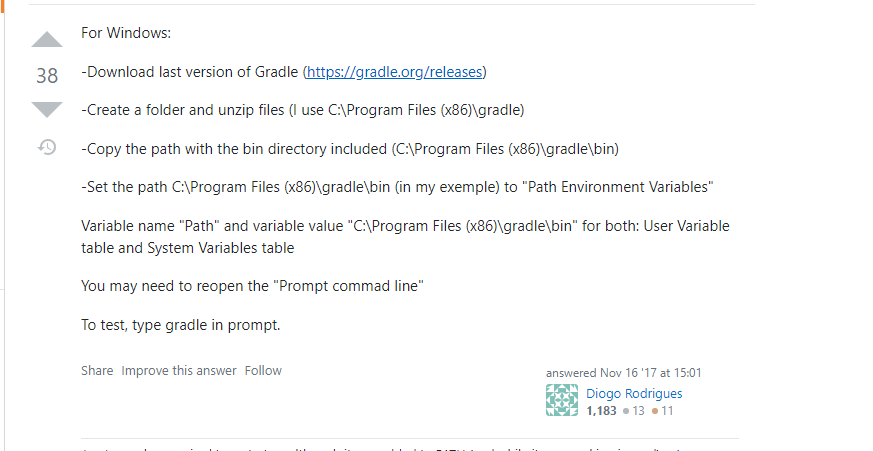
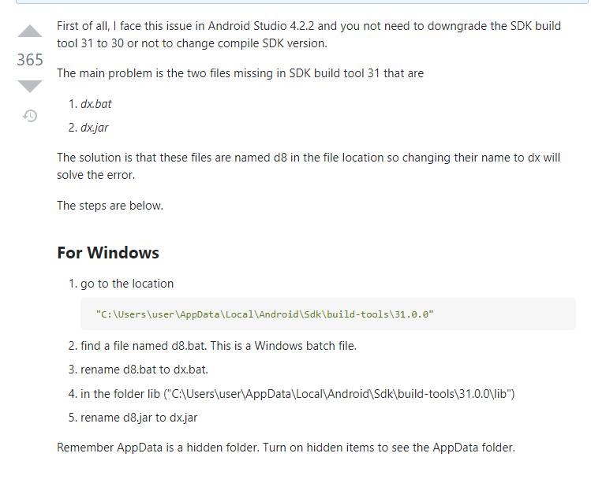

# Apache Cordova Setup and build 
---
This document tries to serve as guide to wrap an application into apache cordova using windows enviroment.

## Install Apache Cordova Globally on Windows

`npm install -g cordova`

## Create base App

`$ cordova create hello com.example.hello HelloWorld`

## Add platforms
`$ cordova platform add android`

## Pre-Requirements
`$ cordova requirements`

## Install dependencies
Java SDK 1.8 (Download & install the latest)
Android Studio (Download & install the latest)
[Gradle](https://gradle.org/releases/) (Download the latest)

# Troubleshooting resourses

### Setup enviroment variables for Gradle
[Stackoverflow Solution](https://stackoverflow.com/questions/43356833/cordova-android-requirements-failed-could-not-find-an-installed-version-of-gra)

### Solving error building the SDK
[Stackoverflow Solution](https://stackoverflow.com/questions/68387270/android-studio-error-installed-build-tools-revision-31-0-0-is-corrupted)

